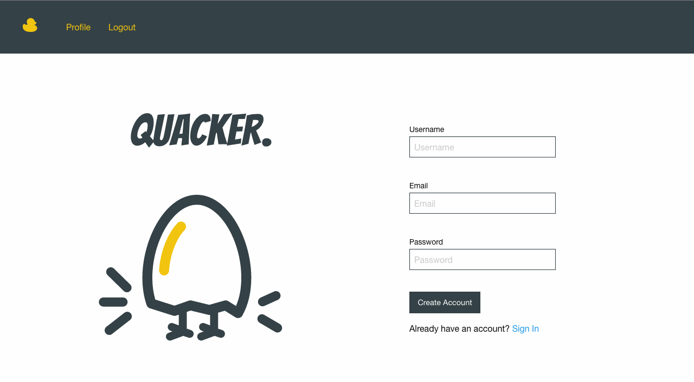
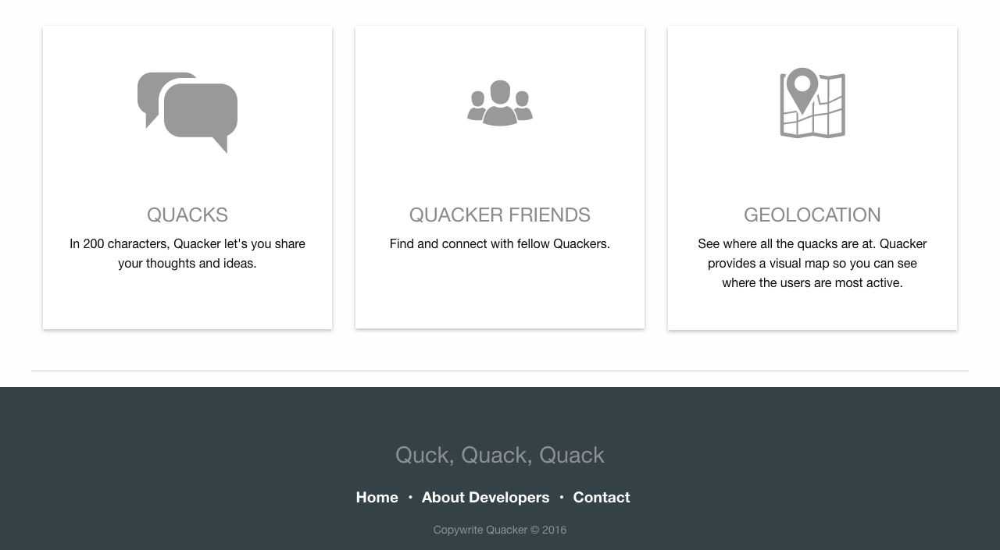
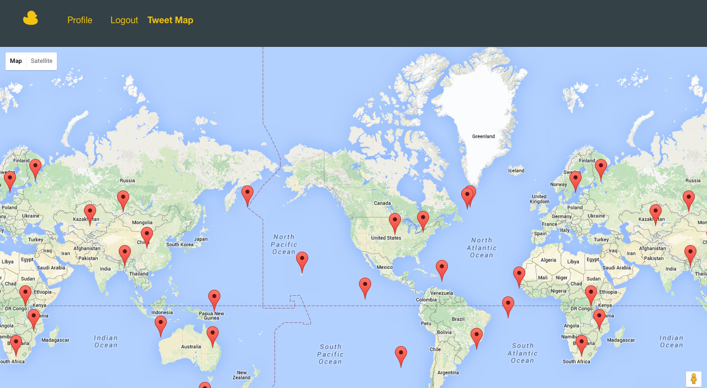

# Quacker
A microblogging app that includes geolocation of user quacks.

## TECHNOLOGIES USED
* Ruby On Rails
* jQuery
* Javascript
* Foundation
* Heroku

## EXISTING FEATURES
* A user can create an account with a photo, username, and email.
* A user can upload a profile photo.
* A user can sign up with an email and will be asked to create a username and password.
* A user will have a quack count, following and followers.
* A user can log-in and log-out of their accounts.
* A user can create, view, update, and delete a quack.
* A user can only update and delete their own quacks.
* A user can view another user's profile with their followers and following.
* A user can click a follow or unfollow button on another user's profile.
* A user can post a quack and will be redirected to their profile.
* A recent quack will have a photo, username and the content of the quack.
* A user will have an option to like a quack or dislike a quack.
* A user can see a map that will display quacks that happened around the world.

## SPECIAL FEATURES
* GOOGLE Maps API (Geolocation)
* Cloudinary API (Photo Upload)

## PLANNED FEATURES
* A geolocation will be added to a user's quack and be taken to a different view where they will see a map of the most tweeted location.
* A user can re-quack another user's quack and add comments to quacks.
* A user can see trending quacks.
* A user can search for a tweet.
* A user can upload a video.
* A user will receive a welcome email after creating an account.
